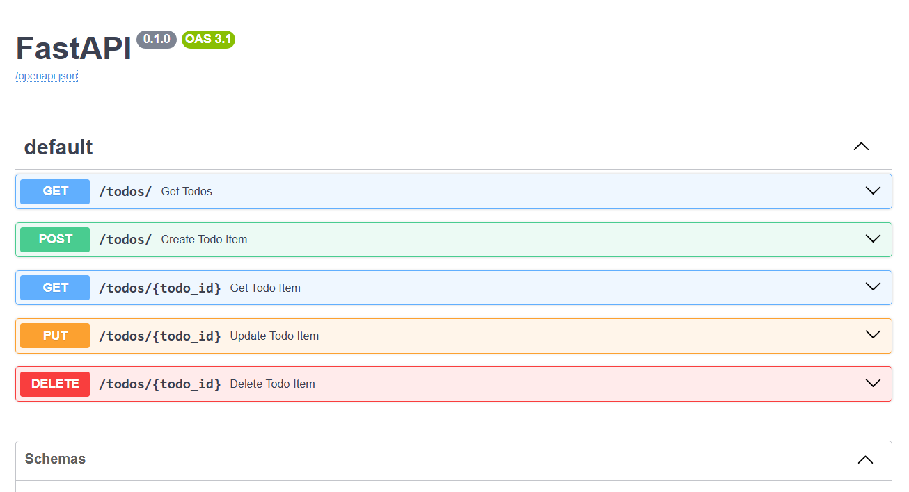
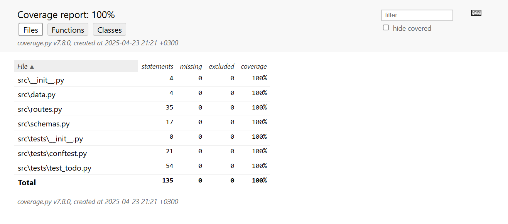

### This repository contains 2 CRUD FastAPI projects with TESTS
- 1st project located in `src` folder - contains simple CRUD for todo app, where **data stored in file** + **TESTS, that override file data with test_data**
- 2nd project located in `src_db` folder - has the same api calls as 1st one BUT **data is stored into db** + **TESTS, that run on separate test_db**

What's used for this project:
1. FastAPI - to create API endpoints
2. Swagger - API documentation http://127.0.0.1:8000/docs & OpenAPI specification JSON format http://127.0.0.1:8000/openapi.json
3. ReDoc - alternative API documentation http://127.0.0.1:8000/redoc
4. Pydantic - data validation for API calls (request & response)
5. Pytest - tests coverage
6. SQLite - db (for project 2)

To run project - move into the project folder `src` or `src_db` and run `fastapi dev .`

**Tests**:
1. Move into the project folder `src` or `src_db`
2. To run tests execute `pytest`
3. To get general test coverage run `pytest --cov` OR for detailed coverage run `coverage html` & open `index.html` in browser to drill down to code lines coverage.

**Swagger documentation:**

**Test coverage report obtained via `coverage html`:**

